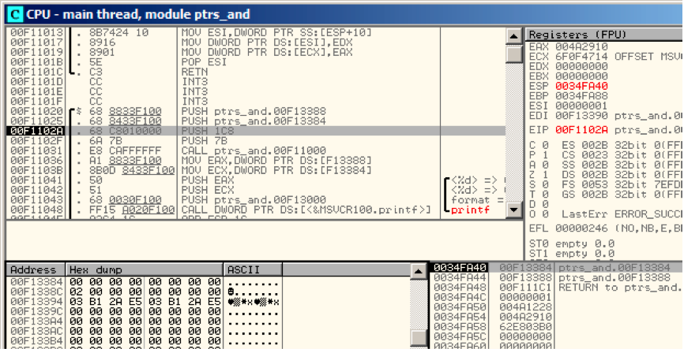
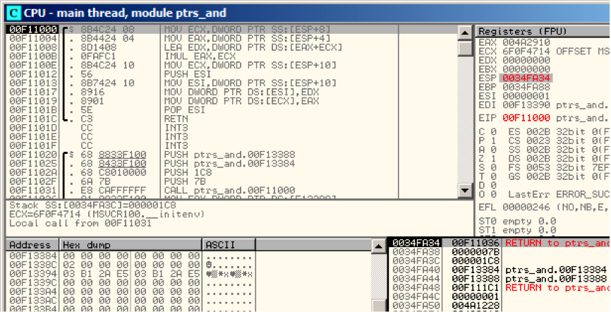
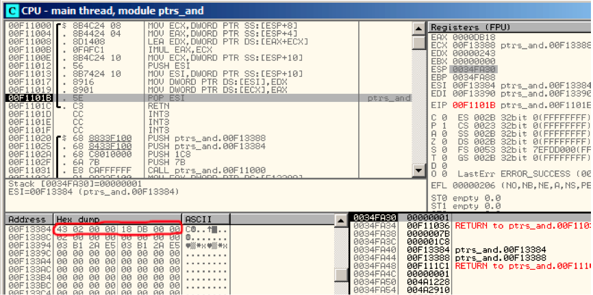
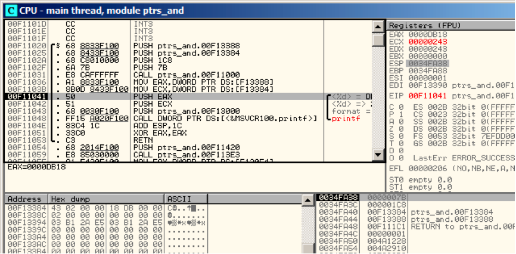
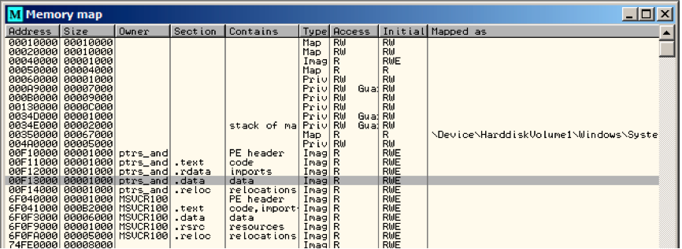
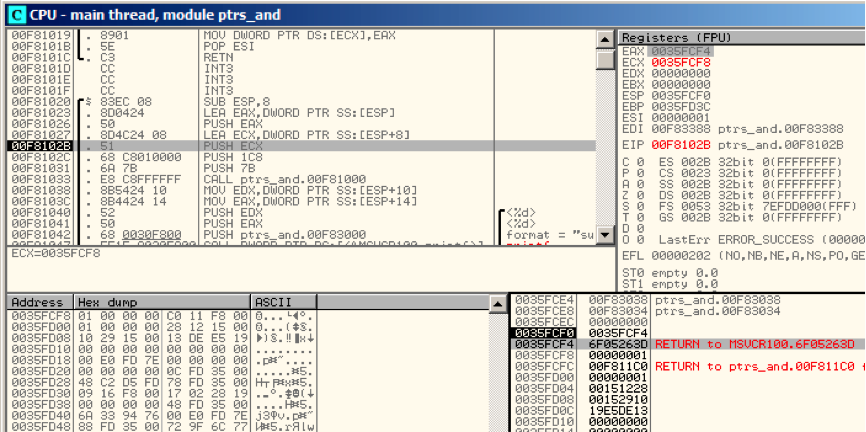
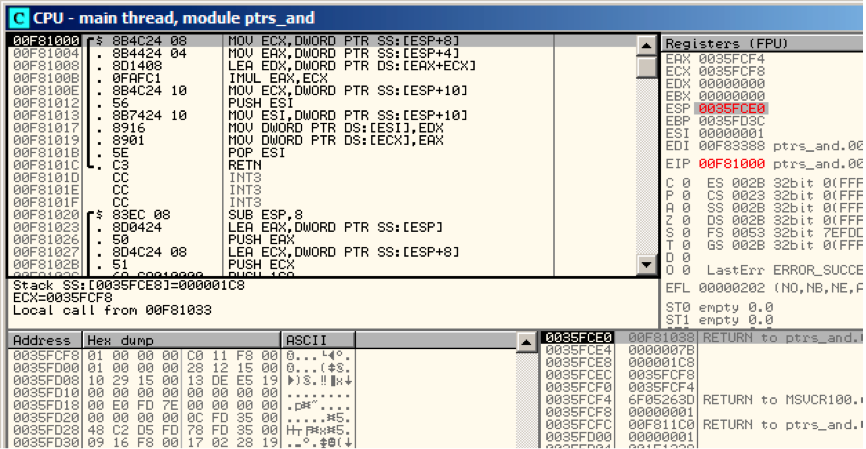
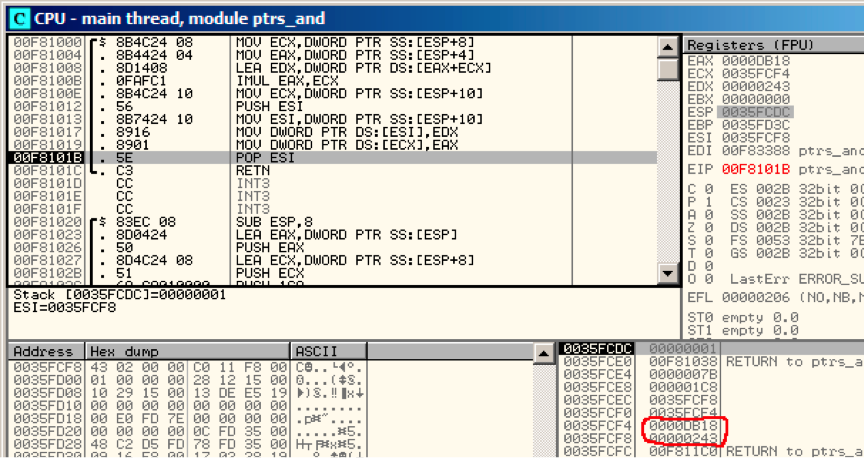

# Chapter 9 指针

指针通常被用作函数返回值(recall scanf() case (6)).例如，当函数返回两个值时。

## 9.1 Global variables example

```
#!bash
#include <stdio.h>

void f1 (int x, int y, int *sum, int *product)
{
    *sum=x+y;
    *product=x*y;
};

int sum, product;

void main()
{
    f1(123, 456, &sum, &product);
    printf ("sum=%d, product=%d
", sum, product);
}; 
```

编译后

Listing 9.1: Optimizing MSVC 2010 (/Ox /Ob0)

```
#!bash
COMM        _product:DWORD
COMM        _sum:DWORD
$SG2803 DB              ’sum=%d, product=%d’, 0aH, 00H

_x$ = 8                                     ; size = 4
_y$ = 12                                    ; size = 4
_sum$ = 16                                  ; size = 4
_product$ = 20                              ; size = 4
_f1         PROC
            mov     ecx, DWORD PTR _y$[esp-4]
            mov     eax, DWORD PTR _x$[esp-4]
            lea     edx, DWORD PTR [eax+ecx]
            imul    eax, ecx
            mov     ecx, DWORD PTR _product$[esp-4]
            push    esi
            mov     esi, DWORD PTR _sum$[esp]
            mov     DWORD PTR [esi], edx
            mov     DWORD PTR [ecx], eax
            pop     esi
            ret     0
_f1         ENDP

_main       PROC
            push    OFFSET _product
            push    OFFSET _sum
            push    456                     ; 000001c8H
            push    123                     ; 0000007bH
            call    _f1
            mov     eax, DWORD PTR _product
            mov     ecx, DWORD PTR _sum
            push    eax
            push    ecx
            push    OFFSET $SG2803
            call    DWORD PTR __imp__printf
            add     esp, 28                 ; 0000001cH
            xor     eax, eax
            ret     0
_main   ENDP 
```

让我们在 OD 中查看：图 9.1。首先全局变量地址被传递进 f1()。我们在堆栈元素点击“数据窗口跟随”，可以看到数据段上分配两个变量的空间。这些变量被置 0，因为未初始化数据（BSS1）在程序运行之前被清理为 0。这些变量属于数据段，我们按 Alt+M 可以查看内存映射 fig. 9.5.

让我们跟踪（F7）到 f1()fig. 9.2.在堆栈中为 456 (0x1C8) 和 123 (0x7B)，接着是两个全局变量的地址。

让我们跟踪到 f1()结尾，可以看到两个全局变量存放了计算结果。

现在两个全局变量的值被加载到寄存器传递给 printf(): fig. 9.4.



Figure 9.1: OllyDbg: 全局变量地址被传递进 f1()



Figure 9.2: OllyDbg: f1()开始



Figure 9.3: OllyDbg: f1()完成



Figure 9.4: OllyDbg: 全局变量被传递进 printf()



Figure 9.5: OllyDbg: memory map

## 9.2 Local variables example

让我们修改一下例子：

Listing 9.2: 局部变量

```
#!bash
void main()
{
    int sum, product; // now variables are here

    f1(123, 456, &sum, &product);
    printf ("sum=%d, product=%d
", sum, product);
}; 
```

f1()函数代码没有改变。仅仅 main()代码作了修改。

Listing 9.3: Optimizing MSVC 2010 (/Ox /Ob0)

```
#!bash
_product$ = -8              ; size = 4
_sum$ = -4                  ; size = 4
_main   PROC
; Line 10
        sub     esp, 8
; Line 13
        lea     eax, DWORD PTR _product$[esp+8]
        push    eax
        lea     ecx, DWORD PTR _sum$[esp+12]
        push    ecx
        push    456         ; 000001c8H
        push    123         ; 0000007bH
        call    _f1
; Line 14
        mov     edx, DWORD PTR _product$[esp+24]
        mov     eax, DWORD PTR _sum$[esp+24]
        push    edx
        push    eax
        push    OFFSET $SG2803
        call    DWORD PTR __imp__printf
; Line 15
        xor     eax, eax
        add     esp, 36     ; 00000024H
        ret     0 
```

我们在 OD 中查看，局部变量地址在堆栈中是 0x35FCF4 和 0x35FCF8。我们可以看到是如何圧栈的 fig. 9.6.

f1()开始的时候，随机栈地址为 0x35FCF4 和 0x35FCF8 fig. 9.7.

f1()完成时结果 0xDB18 和 0x243 存放在地址 0x35FCF4 和 0x35FCF8。



Figure 9.6: OllyDbg: 局部变量地址被圧栈



Figure 9.7: OllyDbg: f1()starting



Figure 9.8: OllyDbg: f1()finished

## 9.3 小结

f1()可以返回结果到内存的任何地方，这是指针的本质和特性。顺便提一下，C++引用的工作方式和这个类似。详情阅读相关内容（33）。