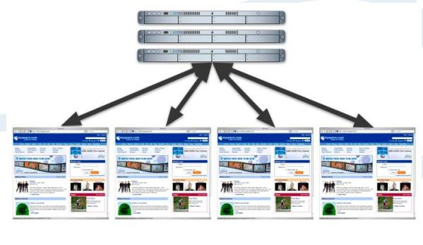

# 对比分析

# 对比分析

通过比较每个蠕虫在第一个 24 小时内的传播总数（图 7 所示），Samy 蠕虫轻而易举地超过了往年的那些蠕虫。 同样重要的是要明白，大多数的蠕虫在操作系统或应用程序级别感染的整个电脑。XSS 蠕虫和病毒，在另一方面，只 感染网络浏览器。但是，跨站脚本恶意软件拥有利用特定的网页浏览器的漏洞直接获得操作系统和应用层上的利用代 码的权力。

图 7，蠕虫的第一个 24 小时的传播量

上图引出了一个非常中肯的问题：为什么 Samy 能够成长的比以前的蠕虫病毒如此的快，而不会造成灾难性的网络拥塞吗？答案可能是 XSS 病毒传播方式不同，并没有引起广泛的网络饱和度，阻碍感染率。 如红色代码，Blaster 和 Slammer 等蠕虫使用快速的方法传播。每个受感染的主机爆炸的互联网 IP 地址范围是困难和尽可能快的，（图 8）。随着受感染机器的数量的增加，所以无用的网络噪声的数量也随着增加。经过一段时 间，感染的网络开始失去其效力，因为目标机器不存在，或仅仅是不容易受到攻击。然后，在某些时候，网络变得 负担过重，最终在流量洪水中崩溃。那么， XSS 蠕虫与这有何不同？

XSS 蠕虫和病毒有一个分布的中心点，Web 服务器，并且执行只发生在 Web 浏览器。接下来，攻击代码只从 Web 服务器发送到浏览器，反之亦然（见图 9），而不是从浏览器到浏览器或其他蠕虫的对等情况。这个特性减少了 网络噪声的体积。此外，每个网站访问代表一个活的计算机和可能的受害者，因为 XSS 恶意软件是不依赖于操作系 统。因此，感染的成功率要大得多。

图 8，对等网络的蠕虫传播

图 9，Web 服务器到 Web 浏览器的蠕虫传播 在本白皮书中开头，我们问：“拥有和控制着超过一百万可支配的 Web 浏览器和千兆带宽，可以做什么？”大规模的分布式拒绝服务攻击（DDoS）是一个简单的答案。让我们保守地说，每个浏览器有一个 128 Kb / s 的平均速 度（千比特/秒），并能产生一个 HTTP 请求，每秒的组合拨号，DSL，电缆，和 T-1 连接。其结果将是 128,000,000 Kb/ s 或 122 Gb / s 的吞吐量和每秒 1,000,000 HTTP 请求- 无疑是一个巨大的资源集合的访问。

作为对照，在 2000 年初，几个大型网站（雅虎，嘉信理财，Amazon.com，ETRADE，CNN.com）被进行了大规 模的 DDoS 攻击。一些网络运营商声称超过 1 Gb / s 的流量。巨大的损失和宕机时间。安全的说，一个设计良好的跨 站脚本蠕虫可能破坏甚至最强大的网络，因为很少，如果有的话，系统可以承受 100 千兆/秒或更大的负荷。在 Samy 蠕虫后的不久，更多的 XSS 蠕虫被发现—或者表明了一种东西到来的趋势。